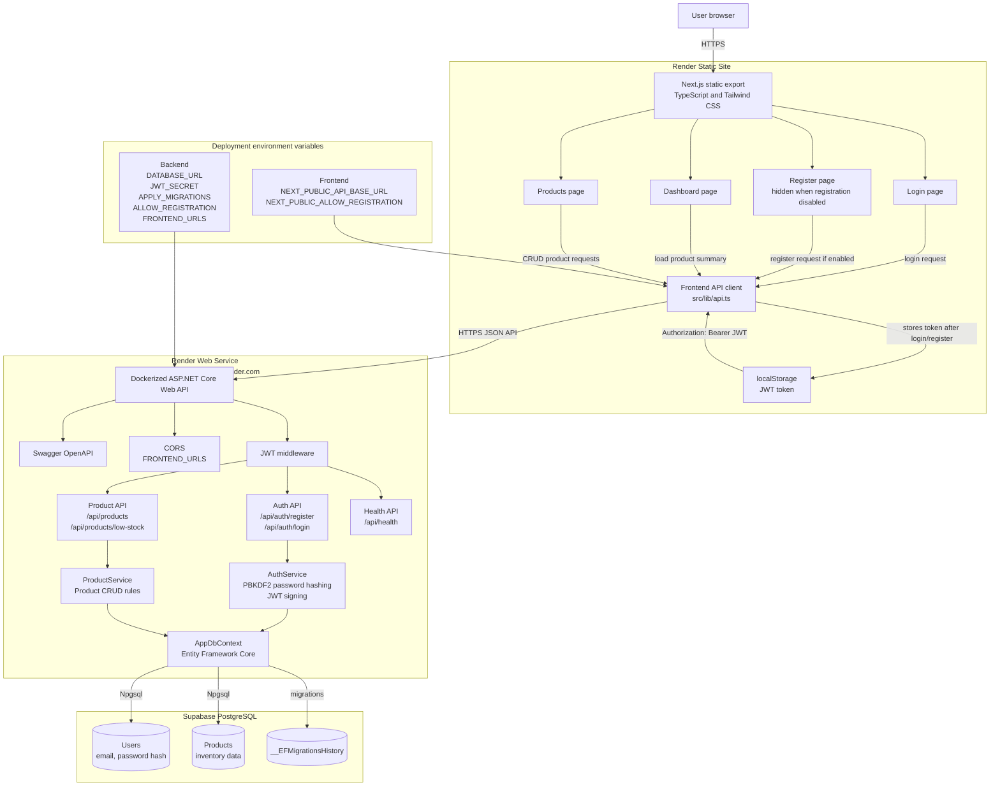
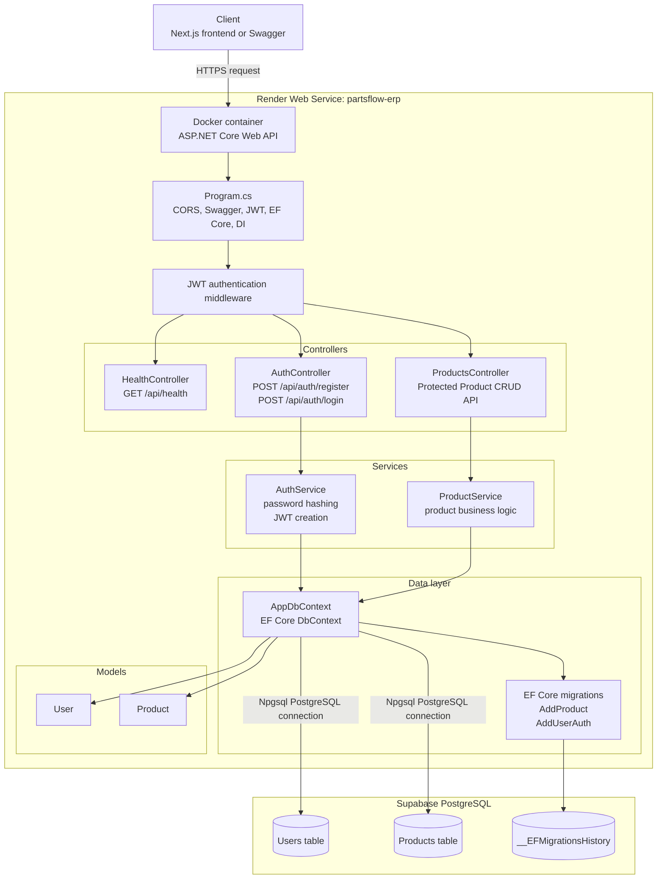
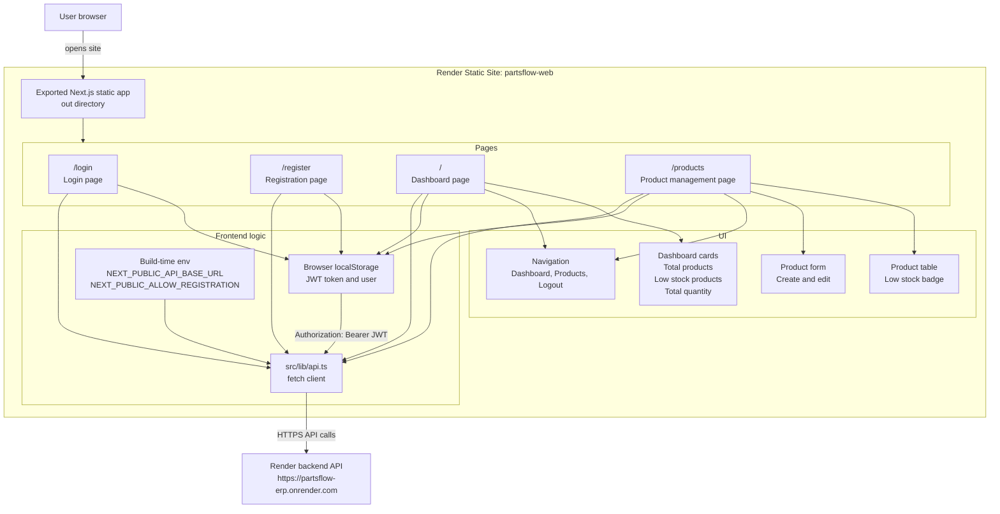

# PartsFlow ERP

PartsFlow ERP is a full-stack inventory management portfolio project for auto parts businesses.

The current MVP provides authenticated product management, inventory dashboard summaries, and low-stock tracking. Users can register or log in, then create, view, update, delete, and monitor auto parts inventory through a Next.js frontend backed by an ASP.NET Core Web API and PostgreSQL database.

## Tech stack

- Backend: ASP.NET Core Web API
- Database: PostgreSQL
- ORM: Entity Framework Core
- API docs: Swagger / OpenAPI
- Frontend: Next.js, TypeScript, Tailwind CSS
- Container: Docker Compose

## Architecture diagrams

The architecture source diagrams live in `docs/architecture`:

- `docs/architecture/full-architecture.mmd`
- `docs/architecture/backend-architecture.mmd`
- `docs/architecture/frontend-architecture.mmd`

### Full architecture



### Backend architecture



### Frontend architecture



## MVP features

- Product catalog CRUD
- User registration and login
- JWT-protected product management
- Low-stock status based on quantity and minimum stock level
- Simple inventory dashboard
- PostgreSQL database with EF Core migration
- Seed demo product data

## Frontend pages

- `/` - Dashboard
- `/products` - Product management
- `/login` - User login
- `/register` - User registration

## Product CRUD description

Products represent auto parts in inventory.

Each product includes:

- SKU
- Name
- Brand
- Category
- Description
- Quantity
- Minimum stock level
- Cost price
- Selling price

A product is considered low stock when:

```text
Quantity <= MinimumStockLevel
```

## API endpoints

- `GET /api/health`
- `POST /api/auth/register`
- `POST /api/auth/login`
- `GET /api/products`
- `GET /api/products/{id}`
- `POST /api/products`
- `PUT /api/products/{id}`
- `DELETE /api/products/{id}`
- `GET /api/products/low-stock`

## Demo data

The `AddProduct` migration seeds these products:

- RCB Brake Caliper
- UMA Racing Camshaft
- KYT Helmet Visor
- Motorcycle Chain 428H
- Engine Oil 10W-40
- Rear Sprocket 36T

## Setup commands

From the project root:

```bash
docker compose up -d postgres
```

Apply database migration:

```bash
cd backend/PartsFlow.Api
dotnet ef database update
```

This applies:

- `AddProduct`
- `AddUserAuth`

## Backend run command

```bash
cd backend/PartsFlow.Api
dotnet run --urls http://localhost:5000
```

Swagger:

```text
http://localhost:5000/swagger
```

## Frontend run command

In a separate terminal:

```bash
cd frontend/partsflow-web
npm install
npm run dev
```

Frontend:

```text
http://localhost:3000
```

The frontend API base URL defaults to:

```text
http://localhost:5000
```

You can override it with:

```bash
NEXT_PUBLIC_API_BASE_URL=http://localhost:5000 npm run dev
```

## Database migration commands

```bash
cd backend/PartsFlow.Api

# Add a migration
dotnet ef migrations add AddProduct

# Apply migrations
dotnet ef database update
```

If your local database contains old development tables and you want a clean reset:

```bash
docker compose down -v
docker compose up -d postgres
cd backend/PartsFlow.Api
dotnet ef database update
```

## Docker command

```bash
docker compose up -d postgres
```

Stop PostgreSQL:

```bash
docker compose stop postgres
```

## Render deployment

This project can be deployed on Render so the app uses public `onrender.com` URLs instead of localhost.

Recommended hosting setup:

1. Supabase PostgreSQL database
2. Render Web Service for the ASP.NET Core API
3. Render Static Site for the Next.js frontend

### Supabase database

Create a Supabase project and use its PostgreSQL connection string for the backend.

Recommended Supabase connection option:

```text
Shared Pooler - Session mode
```

This is usually the safest choice for Render because it works over IPv4 and is suitable for a persistent backend service.

In Supabase:

```text
Project Dashboard -> Connect -> Connection string -> Session pooler
```

Copy the connection string and replace `[YOUR-PASSWORD]` with your Supabase database password.

### Backend API on Render

Create a new Render Web Service from this GitHub repo.

Use these settings:

```text
Language: Docker
Dockerfile Path: backend/PartsFlow.Api/Dockerfile
Health Check Path: /api/health
```

Add these environment variables:

```text
DATABASE_URL=<your Supabase session pooler connection string>
APPLY_MIGRATIONS=true
ENABLE_SWAGGER=true
FRONTEND_URLS=https://<your-frontend-service>.onrender.com
JWT_SECRET=<long random secret for signing login tokens>
ALLOW_REGISTRATION=false
```

Notes:

- `DATABASE_URL` allows the backend to connect to Supabase PostgreSQL.
- `APPLY_MIGRATIONS=true` applies EF Core migrations when the backend starts.
- `ENABLE_SWAGGER=true` keeps Swagger available for portfolio/demo testing.
- Update `FRONTEND_URLS` after the frontend static site has its final Render URL.
- `JWT_SECRET` signs login tokens. Use a long random value and do not share it publicly.
- `ALLOW_REGISTRATION=false` disables public account creation in production.

Backend test URLs:

```text
https://<your-backend-service>.onrender.com/api/health
https://<your-backend-service>.onrender.com/swagger
```

### Frontend on Render

Create a new Render Static Site from this GitHub repo.

Use these settings:

```text
Root Directory: frontend/partsflow-web
Build Command: npm install && npm run export
Publish Directory: out
```

Add this environment variable:

```text
NEXT_PUBLIC_API_BASE_URL=https://<your-backend-service>.onrender.com
NEXT_PUBLIC_ALLOW_REGISTRATION=false
```

Set `NEXT_PUBLIC_ALLOW_REGISTRATION=true` only when you intentionally want to show the registration page.

For a public portfolio demo, the recommended setup is:

1. Temporarily enable registration.
2. Create your demo account.
3. Set backend `ALLOW_REGISTRATION=false`.
4. Set frontend `NEXT_PUBLIC_ALLOW_REGISTRATION=false`.
5. Redeploy backend and frontend.

Frontend URL:

```text
https://<your-frontend-service>.onrender.com
```

### Free tier notes

- Free web services sleep after a period of no traffic, so the first request can be slow.
- Supabase free tier is suitable for a portfolio demo, but keep an eye on project inactivity and quota limits.
- For a long-term production app, upgrade the database plan.

## Screenshots

Screenshots can be added here later:

- Dashboard page (`/`)
- Products table
- Create/edit product form
- Swagger Product API

## Future improvements

- Role-based authorization
- Stock movement
- Sales orders
- Purchase orders
- Supplier management
- Dashboard charts
- Production hardening
